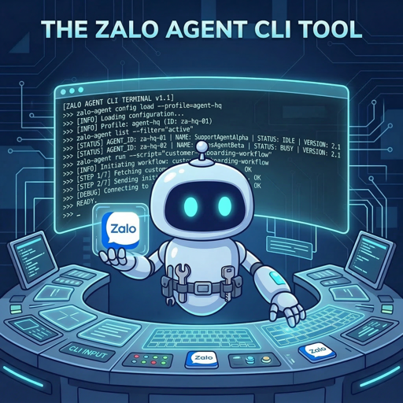

<p align="center">
  
</p>

# zalo-agent-cli

Công cụ CLI tự động hóa Zalo — đa tài khoản, proxy, chuyển khoản ngân hàng, thanh toán QR, Official Account API v3.0, và MCP server cho AI agent.
Xây dựng trên [zca-js](https://github.com/RFS-ADRENO/zca-js).

**[Tiếng Việt](#bắt-đầu-nhanh)** | **[English](#english)**

> [!WARNING]
> Tool này sử dụng API Zalo **không chính thức** ([zca-js](https://github.com/RFS-ADRENO/zca-js)). Zalo không hỗ trợ và **tài khoản của bạn có thể bị khóa hoặc ban**. Tự chịu trách nhiệm. Không liên kết với Zalo hay VNG. Xem [DISCLAIMER.md](DISCLAIMER.md).

> [!IMPORTANT]
> **Zalo chỉ cho phép một phiên web trên mỗi tài khoản — CLI này chiếm phiên đó.**
> Đăng nhập Zalo Web (hoặc ứng dụng PC khác) sẽ thu hồi phiên của CLI ngay lập tức
> ở phía máy chủ, kể cả khi không có tiến trình nào đang chạy. Ngược lại,
> `zalo-agent login` sẽ đăng xuất Zalo Web. Ứng dụng điện thoại không bị ảnh hưởng.
> Đo ngày 20/09/2026.
> Lệnh `oa` là ngoại lệ — chúng dùng **API chính thức** của Zalo OA, không có rủi ro ban.

> [!TIP]
> **AI Agent Skill** — Dùng với OpenClaw, Claude Code, hoặc bất kỳ agent nào hỗ trợ SKILL.md:
> ```bash
> clawhub install zalo-agent          # OpenClaw (từ ClawHub registry)
> cp -r skill/ ~/.claude/skills/zalo-agent/   # Claude Code
> ```
> 16 nhóm lệnh · 178 lệnh · listen mode + webhook · 55+ ngân hàng VN · đa tài khoản + proxy
> Xem [skill/SKILL.md](skill/SKILL.md) · [Tham chiếu lệnh đầy đủ](skill/references/command-reference.md) · [Eval scenarios](skill/evals/)

> [!NOTE]
> **Zalo Official Account (OA)** — Zalo OA API v3.0 chính thức:
> ```bash
> zalo-agent oa init                                    # Setup wizard (interactive)
> zalo-agent oa init --app-id <ID> --secret <KEY> --skip-webhook  # Non-interactive (AI agent)
> zalo-agent oa whoami                                  # Xem thông tin OA
> zalo-agent oa msg text <user-id> "Xin chào"           # Gửi tin nhắn
> zalo-agent oa listen -p 3000                           # Webhook listener
> ```
> OAuth login · gửi tin nhắn · follower · tag · bài viết · cửa hàng · webhook listener · multi-OA · VPS support
> Xem [docs/official-account.md](docs/official-account.md)

> [!TIP]
> **MCP Server (AI Agent Integration)** — Model Context Protocol cho Claude Code và các MCP client:
> ```bash
> zalo-agent mcp start                                  # stdio (local Claude Code)
> zalo-agent mcp start --http 3847 --auth your-secret   # HTTP (VPS)
> ```
> 7 tools: `zalo_get_messages` · `zalo_send_message` · `zalo_list_threads` · `zalo_search_threads` · `zalo_mark_read` · `zalo_get_history` · `zalo_view_media`
> Auto-reconnect · thread filter · noise reduction · tự tải media · thông báo qua nhóm Zalo
> Xem [MCP Guide](skill/references/mcp-guide.md) · [INSTALLATION.md](INSTALLATION.md)

---

## Cài đặt

Yêu cầu **Node.js 22+**.

```bash
npm install -g @ardennguyen/zalo-agent-cli
```

Muốn cài kèm MCP server dạng sandbox (khuyến nghị cho AI client) → xem [INSTALLATION.md](INSTALLATION.md).

## Bắt đầu nhanh

### 1. Đăng nhập

```bash
zalo-agent login
```

Quét QR bằng **Zalo app > Quét mã QR** (không dùng camera thường). QR cũng xem được trên trình duyệt tại `http://<host>:18927/qr`. Thông tin đăng nhập tự động lưu tại `~/.zalo-agent-cli/` (quyền 0600).

### 2. Tìm bạn bè

```bash
zalo-agent friend search "Phúc"
```

### 3. Lắng nghe tin nhắn (lấy thread ID)

```bash
zalo-agent listen
```

Mỗi tin nhắn đến sẽ hiện `threadId`. Dùng `--json` để lấy dạng JSON.

### 4. Gửi tin nhắn

```bash
# Gửi cho cá nhân
zalo-agent msg send <THREAD_ID> "Xin chào!"

# Gửi vào nhóm
zalo-agent msg send <THREAD_ID> "Xin chào nhóm!" -t 1
```

---

## Danh sách lệnh

Tất cả lệnh hỗ trợ `--json`. Tài liệu đầy đủ: **[Wiki](https://github.com/ardennguyen/zalo-agent-cli/wiki)** · [Tham chiếu lệnh đầy đủ](skill/references/command-reference.md)

| Nhóm lệnh | Số lệnh | Mô tả | Docs |
|------------|:---:|--------|------|
| *(top-level)* | 9 | `login`, `logout`, `status`, `whoami`, `update`, `sync-mobile`, `sync-media`, `sync-boards`, `sync-cloud` | [Đăng nhập & Đăng xuất](https://github.com/ardennguyen/zalo-agent-cli/wiki/%C4%90%C4%83ng-Nh%E1%BA%ADp-&-%C4%90%C4%83ng-Xu%E1%BA%A5t) |
| `msg` | 18 | Gửi tin nhắn, hình, file, voice, video, sticker, link, thẻ chuyển khoản, QR, thu hồi, lịch sử | [Tin nhắn](https://github.com/ardennguyen/zalo-agent-cli/wiki/Tin-Nh%E1%BA%AFn) |
| `friend` | 22 | Danh sách, tìm, thêm, xóa, chặn, biệt danh, gợi ý | [Bạn bè](https://github.com/ardennguyen/zalo-agent-cli/wiki/B%E1%BA%A1n-B%C3%A8) |
| `group` | 33 | Tạo, đổi tên, thành viên, cài đặt, link, ghi chú, lời mời | [Nhóm & Cộng đồng](https://github.com/ardennguyen/zalo-agent-cli/wiki/Nh%C3%B3m) |
| `conv` | 15 | Tắt thông báo, ghim, lưu trữ, ẩn hội thoại, tự xóa | [Hội thoại](https://github.com/ardennguyen/zalo-agent-cli/wiki/H%E1%BB%99i-Tho%E1%BA%A1i) |
| `account` | 7 | Đa tài khoản & proxy, thiết bị đã liên kết, xóa tài khoản | [Tài khoản](https://github.com/ardennguyen/zalo-agent-cli/wiki/T%C3%A0i-Kho%E1%BA%A3n) |
| `profile` | 11 | Xem/cập nhật hồ sơ, ảnh đại diện, quyền riêng tư | [Hồ sơ](https://github.com/ardennguyen/zalo-agent-cli/wiki/H%E1%BB%93-S%C6%A1) |
| `poll` | 7 | Tạo, bỏ phiếu, đóng khảo sát | [Khảo sát](https://github.com/ardennguyen/zalo-agent-cli/wiki/Kh%E1%BA%A3o-S%C3%A1t) |
| `reminder` | 6 | Tạo, sửa, xóa nhắc nhở | [Nhắc nhở](https://github.com/ardennguyen/zalo-agent-cli/wiki/Nh%E1%BA%AFc-Nh%E1%BB%9F) |
| `auto-reply` | 4 | Quản lý trả lời tự động | [Trả lời tự động](https://github.com/ardennguyen/zalo-agent-cli/wiki/Tr%E1%BA%A3-L%E1%BB%9Di-T%E1%BB%B1-%C4%90%E1%BB%99ng) |
| `quick-msg` | 4 | Tin nhắn nhanh đã lưu | [Tin nhắn nhanh](https://github.com/ardennguyen/zalo-agent-cli/wiki/Tin-Nh%E1%BA%AFn-Nhanh) |
| `label` | 2 | Nhãn hội thoại | [Nhãn](https://github.com/ardennguyen/zalo-agent-cli/wiki/Nh%C3%A3n) |
| `catalog` | 9 | zBusiness — danh mục sản phẩm | [zBusiness](https://github.com/ardennguyen/zalo-agent-cli/wiki/zBusiness) |
| `listen` | 1 | Lắng nghe real-time, webhook, JSONL, ghi vào cache cục bộ | [Lắng nghe](https://github.com/ardennguyen/zalo-agent-cli/wiki/L%E1%BA%AFng-Nghe) |
| `mcp` | 1 | MCP server (stdio/HTTP) — 7 tools cho AI agent | [MCP Server](https://github.com/ardennguyen/zalo-agent-cli/wiki/MCP-Server-(VN)) |
| **`oa`** | **32** | **Zalo Official Account API v3.0 — OAuth, tin nhắn, follower, tag, bài viết, cửa hàng, webhook** | **[Official Account](https://github.com/ardennguyen/zalo-agent-cli/wiki/Official-Account-(VN))** |

Xem thêm: [Đa tài khoản & Proxy](https://github.com/ardennguyen/zalo-agent-cli/wiki/%C4%90a-T%C3%A0i-Kho%E1%BA%A3n-&-Proxy) · [Cài đặt VPS](https://github.com/ardennguyen/zalo-agent-cli/wiki/C%C3%A0i-%C4%90%E1%BA%B7t-VPS) · [Thẻ chuyển khoản & QR](https://github.com/ardennguyen/zalo-agent-cli/wiki/Th%E1%BA%BB-Chuy%E1%BB%83n-Kho%E1%BA%A3n-&-QR) · [Bộ nhớ đệm & Đồng bộ](https://github.com/ardennguyen/zalo-agent-cli/wiki/B%E1%BB%99-Nh%E1%BB%9B-%C4%90%E1%BB%87m-&-%C4%90%E1%BB%93ng-B%E1%BB%99) · [Bảo mật](https://github.com/ardennguyen/zalo-agent-cli/wiki/B%E1%BA%A3o-M%E1%BA%ADt)

---

## Tính năng

- Đăng nhập QR qua HTTP server tự động (browser + terminal), báo ngay khi bị **từ chối trên điện thoại** thay vì treo tới hết 60s
- Đa tài khoản với proxy riêng biệt (1:1), device fingerprint riêng cho từng tài khoản
- **178 lệnh** phủ hết tính năng Zalo cá nhân
- **Zalo Official Account (OA) API v3.0** — OAuth login, gửi tin nhắn, follower, tag, bài viết, cửa hàng, webhook listener, multi-OA
- **MCP server** (stdio + HTTP) — 7 tools cho Claude Code và các MCP client
- **Bộ nhớ đệm cục bộ (SQLite)** — `listen` ghi mọi tin nhắn vào `zalo.db`, `msg history` đọc từ cache, `sync-mobile --transfer` khôi phục toàn bộ lịch sử từ điện thoại vào `zalo.db` (giải mã transfer-sync-v2; xác nhận một lần trên điện thoại), thêm `--days <n>` nếu chỉ cần *n* ngày gần nhất. Luồng đồng bộ chỉ mang **liên kết** media chứ không mang file, nên sau khi lưu tin nhắn, `--transfer` **tự động tải media về** (thêm `--messages-only` nếu chỉ muốn tin nhắn); `sync-media` chạy lại/tiếp tục bước tải này, không cần xác nhận trên điện thoại. Ghi chú, tin ghim, bình chọn và nhắc hẹn nằm ngoài luồng tin nhắn — dùng `sync-boards`
- Tự động tải media (ảnh/audio/video) — `listen`/`msg` lưu vào `~/.zalo-agent-cli/accounts/<id>/media/`, MCP server lưu vào `~/.zalo-agent-cli/media/<tên-thread>/`
- Thẻ chuyển khoản (55+ ngân hàng VN) & QR VietQR
- Lắng nghe real-time với webhook & lưu JSONL local
- `logout` hủy phiên **phía server** thật sự; `logout --purge` / `account remove` xóa sạch dữ liệu cục bộ
- Output `--json` cho mọi lệnh — scripting & AI agents
- Credentials lưu cục bộ với quyền 0600
- **Dual mode**: interactive (con người) + non-interactive (AI agents, CI/CD)

## Tài liệu

| Tài liệu | Nội dung |
|----------|----------|
| [INSTALLATION.md](INSTALLATION.md) | Cài đặt `zalo-mcp` wrapper, cấu hình MCP client, thiết lập OA |
| [docs/official-account.md](docs/official-account.md) | Tham chiếu đầy đủ lệnh OA (tiếng Việt) |
| [skill/SKILL.md](skill/SKILL.md) | Skill cho AI agent |
| [skill/references/command-reference.md](skill/references/command-reference.md) | Tham chiếu lệnh đầy đủ (nguồn chuẩn) |
| [skill/references/mcp-guide.md](skill/references/mcp-guide.md) | Hướng dẫn MCP server (tiếng Việt) |
| [skill/references/oa-command-reference.md](skill/references/oa-command-reference.md) | Tham chiếu nhanh lệnh OA cho agent |
| [skill/references/login-flow.md](skill/references/login-flow.md) | Các cách đăng nhập (QR, proxy, credentials) |
| [skill/references/listen-mode-guide.md](skill/references/listen-mode-guide.md) | Vận hành listener và webhook |
| [tests/README.md](tests/README.md) | Cách chạy và viết test: bộ offline, E2E phân tầng + checklist thủ công |
| [DISCLAIMER.md](DISCLAIMER.md) | Điều khoản đầy đủ và cảnh báo rủi ro |
| [AGENTS.md](AGENTS.md) | Quy tắc dự án cho AI coding agent |
| [Wiki](https://github.com/ardennguyen/zalo-agent-cli/wiki) | Tài liệu công khai, song ngữ EN + VN |

---

## English

CLI tool for Zalo automation — multi-account, proxy support, bank transfers, QR payments, Official Account API v3.0, and an MCP server for AI agents.

> [!IMPORTANT]
> **Zalo allows one web session per account — this CLI occupies it.**
> Signing into Zalo Web (or another PC client) revokes the CLI's session
> server-side, instantly, even with nothing running. The reverse is also true:
> `zalo-agent login` signs Zalo Web out. Your phone app is unaffected.
> Measured 2026-09-20.

> [!TIP]
> **AI Agent Skill** — Use with OpenClaw, Claude Code, or any SKILL.md-compatible agent:
> ```bash
> clawhub install zalo-agent                    # OpenClaw (from ClawHub registry)
> cp -r skill/ ~/.claude/skills/zalo-agent/     # Claude Code
> ```
> 16 command groups · 178 commands · listen mode + webhook · 55+ VN banks · multi-account + proxy
> See [skill/SKILL.md](skill/SKILL.md) · [Full command reference](skill/references/command-reference.md) · [Eval scenarios](skill/evals/)

> [!NOTE]
> **Zalo Official Account (OA)** — Official Zalo OA API v3.0:
> ```bash
> zalo-agent oa init                                    # Setup wizard (interactive)
> zalo-agent oa init --app-id <ID> --secret <KEY> --skip-webhook  # Non-interactive (AI agent)
> zalo-agent oa whoami                                  # OA profile
> zalo-agent oa msg text <user-id> "Hello"              # Send message
> zalo-agent oa listen -p 3000                           # Webhook listener
> ```
> OAuth login · messaging · followers · tags · articles · store · webhook listener · multi-OA · VPS support
> See [docs/official-account.md](docs/official-account.md)

> [!TIP]
> **MCP Server (AI Agent Integration)** — Model Context Protocol support for Claude Code and MCP clients:
> ```bash
> zalo-agent mcp start                                  # stdio (local Claude Code)
> zalo-agent mcp start --http 3847 --auth your-secret   # HTTP (VPS)
> ```
> 7 tools: `zalo_get_messages` · `zalo_send_message` · `zalo_list_threads` · `zalo_search_threads` · `zalo_mark_read` · `zalo_get_history` · `zalo_view_media`
> Auto-reconnect · thread filter · noise reduction · media auto-download · Zalo-group notifications
> See [MCP Guide](skill/references/mcp-guide.md) · [INSTALLATION.md](INSTALLATION.md)

### Quick Start

Requires **Node.js 22+**.

```bash
npm install -g @ardennguyen/zalo-agent-cli
zalo-agent login                           # 1. Login via QR
zalo-agent friend search "Name"            # 2. Find a friend
zalo-agent listen                          # 3. Listen for threadId
zalo-agent msg send <THREAD_ID> "Hello!"   # 4. Send a message
```

For the sandboxed MCP-server install (recommended for AI clients), see [INSTALLATION.md](INSTALLATION.md).

### Commands

Full docs: **[Wiki](https://github.com/ardennguyen/zalo-agent-cli/wiki)** · [Full command reference](skill/references/command-reference.md)

| Group | Commands | Description | Docs |
|-------|:---:|-------------|------|
| *(top-level)* | 9 | `login`, `logout`, `status`, `whoami`, `update`, `sync-mobile`, `sync-media`, `sync-boards`, `sync-cloud` | [Login & Logout](https://github.com/ardennguyen/zalo-agent-cli/wiki/Login-&-Logout) |
| `msg` | 18 | Text, images, files, voice, video, stickers, links, bank cards, QR, recall, history | [Messages](https://github.com/ardennguyen/zalo-agent-cli/wiki/Messages) |
| `friend` | 22 | List, find, add, remove, block, alias, recommendations | [Friends](https://github.com/ardennguyen/zalo-agent-cli/wiki/Friends) |
| `group` | 33 | Create, rename, members, settings, links, notes, invites | [Groups](https://github.com/ardennguyen/zalo-agent-cli/wiki/Groups) |
| `conv` | 15 | Mute, pin, archive, hidden, auto-delete | [Conversations](https://github.com/ardennguyen/zalo-agent-cli/wiki/Conversations) |
| `account` | 7 | Multi-account & proxy, linked devices, account removal | [Accounts](https://github.com/ardennguyen/zalo-agent-cli/wiki/Accounts) |
| `profile` | 11 | Profile, avatar gallery, privacy | [Profile](https://github.com/ardennguyen/zalo-agent-cli/wiki/Profile) |
| `poll` | 7 | Create, vote, lock polls | [Polls](https://github.com/ardennguyen/zalo-agent-cli/wiki/Polls) |
| `reminder` | 6 | Create, edit, remove reminders | [Reminders](https://github.com/ardennguyen/zalo-agent-cli/wiki/Reminders) |
| `auto-reply` | 4 | Auto-reply rules | [Auto-Reply](https://github.com/ardennguyen/zalo-agent-cli/wiki/Auto-Reply) |
| `quick-msg` | 4 | Saved quick messages | [Quick Messages](https://github.com/ardennguyen/zalo-agent-cli/wiki/Quick-Messages) |
| `label` | 2 | Conversation labels | [Labels](https://github.com/ardennguyen/zalo-agent-cli/wiki/Labels) |
| `catalog` | 9 | zBusiness catalogs & products | [Catalog](https://github.com/ardennguyen/zalo-agent-cli/wiki/Catalog) |
| `listen` | 1 | Real-time listener, webhook, JSONL, local cache writes | [Listener](https://github.com/ardennguyen/zalo-agent-cli/wiki/Listener) |
| `mcp` | 1 | MCP server (stdio/HTTP) — 7 tools for AI agents | [MCP Server](https://github.com/ardennguyen/zalo-agent-cli/wiki/MCP-Server) |
| **`oa`** | **32** | **Zalo Official Account API v3.0 — OAuth, messaging, followers, tags, articles, store, webhook** | **[Official Account](https://github.com/ardennguyen/zalo-agent-cli/wiki/Official-Account)** |

See also: [Multi-Account & Proxy](https://github.com/ardennguyen/zalo-agent-cli/wiki/Multi-Account-&-Proxy) · [VPS Setup](https://github.com/ardennguyen/zalo-agent-cli/wiki/VPS-Setup) · [Bank Card & QR Payments](https://github.com/ardennguyen/zalo-agent-cli/wiki/Bank-Card-&-QR-Payments) · [Local Cache & Sync](https://github.com/ardennguyen/zalo-agent-cli/wiki/Local-Cache-&-Sync) · [Security](https://github.com/ardennguyen/zalo-agent-cli/wiki/Security)

### Features

- QR login over an auto-started HTTP server (browser + terminal), reporting a **decline on the phone** immediately instead of hanging until the 60s timeout
- Multi-account with a dedicated proxy (1:1) and a per-account device fingerprint
- **178 commands** covering the personal-account Zalo surface
- **Zalo Official Account (OA) API v3.0** — OAuth login, messaging, followers, tags, articles, store, webhook listener, multi-OA
- **MCP server** (stdio + HTTP) — 7 tools for Claude Code and other MCP clients
- **Local SQLite cache** — `listen` writes every message to `zalo.db`, `msg history` reads from it, and `sync-mobile --transfer` restores full history from the phone into `zalo.db` (transfer-sync-v2 decrypt; one confirmation on the phone), or `--days <n>` for just the last *n* days. The sync stream carries media **links**, not files, so a `--transfer` run **downloads its attachments automatically** once the messages are stored (`--messages-only` skips it); `sync-media` re-runs or resumes that fetch on its own, with no phone confirmation. Notes, pinned messages, polls and reminders live outside the message stream — `sync-boards` fetches those
- Automatic media download — `listen`/`msg` save to `~/.zalo-agent-cli/accounts/<id>/media/`, the MCP server saves to `~/.zalo-agent-cli/media/<threadName>/`
- Bank cards (55+ VN banks) and VietQR payment images
- Real-time listener with webhook forwarding and local JSONL archival
- `logout` performs a real **server-side** session invalidation; `logout --purge` / `account remove` wipe all local data
- `--json` output on every command — scripting and AI agents
- Credentials stored locally with 0600 permissions
- **Dual mode**: interactive (human) and non-interactive (AI agents, CI/CD)

### Documentation

| Document | Contents |
|----------|----------|
| [INSTALLATION.md](INSTALLATION.md) | `zalo-mcp` wrapper install, MCP client config, OA setup |
| [docs/official-account.md](docs/official-account.md) | Full OA command reference (Vietnamese) |
| [skill/SKILL.md](skill/SKILL.md) | AI agent skill |
| [skill/references/command-reference.md](skill/references/command-reference.md) | Exhaustive command reference (source of truth) |
| [skill/references/mcp-guide.md](skill/references/mcp-guide.md) | MCP server guide (Vietnamese) |
| [skill/references/oa-command-reference.md](skill/references/oa-command-reference.md) | OA quick reference for agents |
| [skill/references/login-flow.md](skill/references/login-flow.md) | Login methods (QR, proxy, credentials file) |
| [skill/references/listen-mode-guide.md](skill/references/listen-mode-guide.md) | Listener and webhook operation |
| [tests/README.md](tests/README.md) | How to run and write the tests: offline suite, tiered live E2E, manual checklist |
| [DISCLAIMER.md](DISCLAIMER.md) | Full terms and risk warning |
| [AGENTS.md](AGENTS.md) | Project rules for AI coding agents |
| [Wiki](https://github.com/ardennguyen/zalo-agent-cli/wiki) | Public docs, bilingual EN + VN |

---

## License

[MIT](LICENSE) · See [DISCLAIMER.md](DISCLAIMER.md) for full terms.
