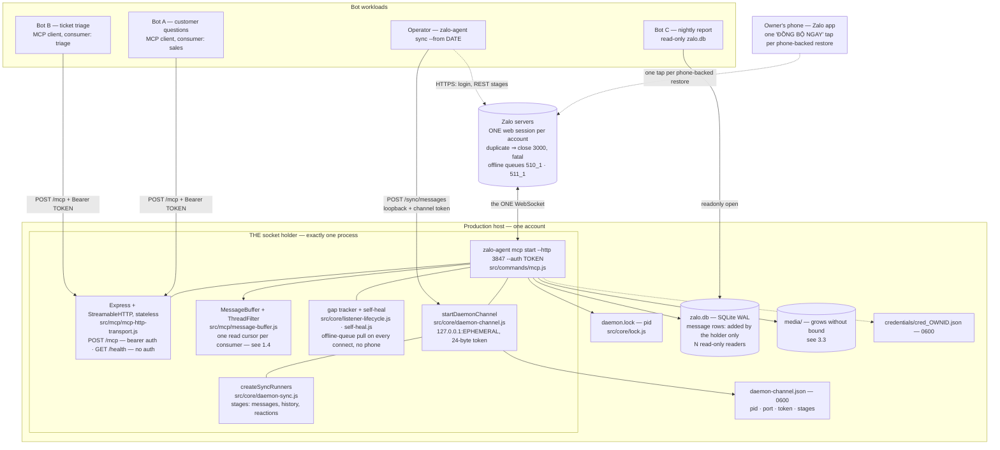
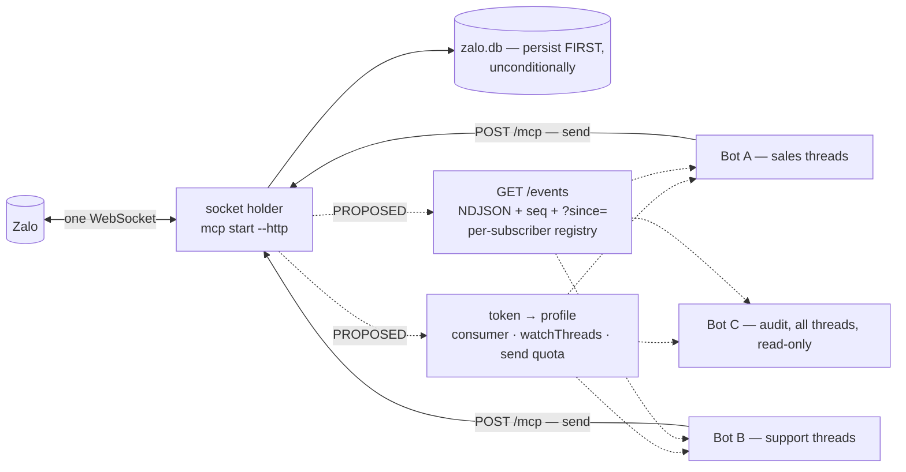

# Production deployment — `zalo-agent-cli` + `zalo-mcp` as a smart autobot

**Status:** re-verified 2026-09-30 against `zalo-agent-cli` `2.0.0` (branch `v2.0-dev` at `9e47020`), the `zalo-mcp` wrapper's `main` branch (`1.0.16`), and the npm registry on the same day. First written 2026-09-29.
**Audience:** whoever runs this on a server and gets paged when it stops.

Every architectural claim below is traced to a file in `src/`, or, for the command surface, to [`skill/references/command-reference.md`](../skill/references/command-reference.md), which wins whenever two docs disagree. Line numbers refer to `9e47020` and will drift; the function and handler names next to them will not. Numbers come from `package.json`, the lockfile, the code, the npm registry, or one account directory measured once (labeled where it is used). The [Appendix](#appendix--re-measure-everything-yourself) has the commands to measure your own. Where a sentence is an assessment rather than something the code shows (the sizing tables, and all of §6), it says so. On this codebase the general answer about "how messaging bots usually work" is often wrong, so this document avoids it.

Two conventions used throughout:

- `<ownId>` is your account's numeric Zalo own-id. Never write a real one into a config file that gets committed, an issue, or a ticket.
- Alerts mark the line between what ships today and what does not:
  - `> [!NOTE]` — a design proposal. **Not implemented. Do not plan around it as if it were.**
  - `> [!WARNING]` — a real, current behavior that will bite you.
  - `> [!CAUTION]` — something that loses data or gets the account banned.

---

## 0. The short version

**Topology.** Run exactly **one** socket-holding process per Zalo account: `zalo-agent mcp start --http <port> --auth <token>`. That process owns the account's one permitted WebSocket, holds `daemon.lock`, publishes `daemon-channel.json`, and is the only process that adds message rows to `zalo.db` while it runs: live traffic, its own catch-up from Zalo's offline queue, a `zalo-agent sync` restore and a `msg history` fetch all run inside it. Every bot workload is a **client** of that process: MCP clients over `POST /mcp` (the HTTP transport is stateless, so concurrent clients work, and each bot keeps its own read cursor by passing a `consumer` name), and CLI one-shots that hand anything needing the socket to the daemon over its loopback channel. No bot opens its own WebSocket.

**Biggest constraint.** Zalo permits one web session per account; a duplicate is closed with code `3000`, and both `listen` and `mcp start` treat that as fatal and `process.exit(1)`. A browser tab running Zalo Web counts. This is not a tunable.

**What several bots get today.** They can share one server safely for reading as well as sending: `zalo_mark_read` moves only the calling consumer's cursor and deletes nothing. What does not exist: push delivery of inbound events (bots poll), any per-bot identity or scope (one bearer token, self-declared consumer names, one thread filter per process), and any limit on outbound sends. See §1.4.

**The wrapper does not run this code.** A `zalo-mcp` install runs whichever engine version npm serves it. As of 2026-09-30 npm has exactly one version of the engine, `1.0.7`, so none of the 2.0.0 behavior described here reaches a wrapper install. For a server, install the engine directly (§4.1).

**LLM backend.** An assessment, not a measurement: Claude via the API, in an organization the company owns, for the customer-facing Vietnamese path. See §6 for why, and what to use instead per workload.

---

## 1. The hard problem: one socket, many bots

### 1.1 The constraint, in code

| Fact | Where |
|---|---|
| One web session per account; a duplicate closes with `3000` | `AGENTS.md` §13; `const CLOSE_DUPLICATE = 3000;` in both entry points, commented "fatal, do not retry" in `src/commands/mcp.js` |
| `listen` exits on `3000` | `src/commands/listen.js`, the `closed` handler in `attachAllHandlers`: `error("Another Zalo Web session opened. Listener stopped."); process.exit(1);`. It does not release `daemon.lock` first; the next start reclaims it through the stale-PID check |
| `mcp start` exits on `3000` | `src/commands/mcp.js`, the `closed` handler in `attachListenerHandlers`: `dropLock();` (stops the channel, releases the lock), then `[mcp] Duplicate Zalo Web session detected. Exiting.` and `process.exit(1);` |
| `listen` and `mcp start` are mutually exclusive | Both call `acquireLock(accountDir)` before opening the database (`listen.js:86`, `mcp.js:136`) and exit when it fails |
| The lock is a PID file with an atomic create | `src/core/lock.js` `acquireLock`: `fs.writeFileSync(lockPath, process.pid.toString(), { flag: "wx" })`, with a stale-PID reclaim through `isProcessAlive` (`process.kill(pid, 0)`) |

So the very first deployment decision is forced: **you get one socket-holding process, and it is either `listen` or `mcp start`, never both.**

> [!WARNING]
> `listen` and `mcp start` are two entry points to the same socket, and `AGENTS.md` §13 treats any asymmetry between them as a defect. They keep the same bookkeeping, but they do not serve the same things, and that difference decides your deployment:
>
> | | `listen` | `mcp start` |
> |---|---|---|
> | MCP tool surface (the 12 tools in `src/mcp/mcp-tools.js`) | no | **yes** |
> | HTTP `/health` | no | **yes** (`--http` only) |
> | `--webhook <url>` outbound fan-out | **yes** | no |
> | `--save <dir>` JSONL archive | **yes** | no |
> | Event printing (`--events`, `--filter`, `--no-self`), `--auto-accept` | **yes** | no |
> | Owner notifications (`notify.*`, see §7.2) | no | yes |
> | Coverage-gap tracking (`sync_gaps`) | yes, written inline in `listen.js` | yes, `createGapTracker` in `src/core/listener-lifecycle.js` |
> | Self-heal from Zalo's offline queue on every connect (`--no-self-heal` opts out) | yes | yes |
> | Delivered receipts (`--no-delivered-receipts` opts out); read state reported by other devices | yes | yes |
> | Daemon channel (`/send-attachments`, `/sync/messages`, `/sync/reactions`, `/sync/history`) | yes | yes |
> | Where its own lines go | notices on stdout, `[listen]` diagnostics on stderr | everything on stderr |
>
> `tests/unit/listener-lifecycle-rules.test.js` holds both to the same gap rules (each builds a `SyncManager` and files a startup gap), and `tests/unit/self-heal-wiring.test.js` runs its wiring checks against both files. Loss detection is therefore no longer a reason to pick one over the other: pick `mcp start` for MCP bots, `listen` for a webhook or JSONL consumer.

> [!NOTE]
> **`mcp start`'s tools follow a re-login.** A socket that closes for good (a `closed` event with any code except `3000`; zca-js retries some drops itself) is handled inside the process: `clearSession()`, then `autoLogin()`, which builds a new zca-js API object (`loginWithCredentials` in `src/core/zalo-client.js`). The listener handlers, the self-heal, the daemon channel and media downloads follow the new object through `getApi()`, and so do the twelve tools and the notifier: they are handed `liveApi(getApi)` (`src/core/live-api.js`), which reads the current session at every call. Before 2.0.0's fix they were handed the start-up object once, so after a `Re-login successful` line they kept calling the replaced session, and `zalo_get_history`'s socket scan paged a closed listener. While a re-login is in flight, a tool call fails with "The Zalo session is logging in again after a dropped connection; try again in a few seconds."

### 1.2 What `daemon-channel.js` actually is

`src/core/daemon-channel.js` is a **loopback HTTP server the socket holder runs on behalf of processes that need a socket but must not open one.** Its shape:

- `startDaemonChannel({ getApi, accountDir, onLog, runners, lock })` listens with `server.listen(0, "127.0.0.1")`: an ephemeral port, loopback only, never `0.0.0.0`. The comment says why: these endpoints send messages as the logged-in account and restore its history.
- It writes `daemon-channel.json` (`{ pid, port, token, stages }`) with `{ mode: 0o600 }`. The token is `randomBytes(24).toString("hex")`, travels in the JSON request body, and is compared by `tokenMatches`: a length check, then `timingSafeEqual`.
- Four routes, all `POST`: `/send-attachments`, `/sync/messages`, `/sync/reactions` and `/sync/history`. Anything else is a 404 before the body is read, and a body over 64 KB is cut off. `/sync/history` is what `msg history` uses when a daemon is up: the daemon fetches and writes, and the CLI only displays (`src/core/history-fetch.js`).
- `getDaemonChannel(accountDir)` is the discovery function. It reads the descriptor and **deletes it on sight if `process.kill(pid, 0)` says the pid is gone**, so a crashed daemon cannot make every later send dial a dead port.
- `getSyncChannel(accountDir, stage)` adds a capability check against the advertised `stages` array, which lists the runners the daemon wired (`messages`, `history` and `reactions` from `createSyncRunners` in `src/core/daemon-sync.js`). A daemon started before sync routing existed publishes a valid channel with no stages. The descriptor is asked rather than the route probed, because probing would mean sending something.
- `createStageLock()` allows one stage at a time on the socket. The routes hold it, and so do two jobs the daemon runs itself: the self-heal catch-up (§4.5), which waits its turn, and `zalo_get_history`'s server fallback, which answers "A <stage> stage is running on this socket. Try again when it finishes." rather than waiting behind a restore. A route that finds the lock taken answers `409` with the busy stage and its start time.
- A stage streams NDJSON back over a chunked response: `{"t":"event"}` per progress callback, `{"t":"ping"}` every 20 s, then `{"t":"done"}` or `{"t":"error"}`. The client gives up after 90 s without a line. A client that walks away does not abort the stage, because the restore is already writing real messages.

Two design rules are load-bearing:

1. **`getApi` is a function, never a captured `api` object.** On a re-login the daemon builds a new api; an upload parked in the old one's `ctx.uploadCallbacks` can never be settled and the send hangs forever. The channel and the stage runners follow this rule; the MCP tools do not (§1.1).
2. **The channel is a transport and imports nothing but node builtins.** `tests/unit/daemon-channel.test.js` enforces it. Stage bodies live in `src/core/daemon-sync.js` and are injected as `runners`, because `msg send` imports the channel for `sendViaDaemon`, and importing SyncV2 there would drag its decrypt stack, its CDN asset fetcher and its database writes into every message send.

The failure semantics differ deliberately between the two client helpers, and you need to know which is which when you read logs:

- `sendViaDaemon()`: **every** failure resolves `null`, which sends the caller down its own-socket path. An unreachable daemon degrades to the old behavior.
- `syncViaDaemon()`: only "there is no daemon at all" (no descriptor, or a dead pid) returns `null`. A live pid whose port refuses the connection returns `{ok: false, disconnected: true, …}`, because **the process still holds the WebSocket**, and a caller that "fell back" would evict it. That asymmetry is the whole safety property.

### 1.3 Does this pattern generalize to N consumers?

**For outbound work: yes.**

- The MCP HTTP transport is **stateless**: `new StreamableHTTPServerTransport({ sessionIdGenerator: undefined })`, with a fresh `McpServer` and transport built for each `POST /mcp` and closed on `res.on("close")` (`src/mcp/mcp-http-transport.js`). Nothing in that path is per-client, so several bots can POST concurrently. A probe against this code confirmed that one `tools/call` POST is a complete call with no `initialize` first; the client must send `Accept: application/json, text/event-stream` (the transport answers `406` otherwise) and gets the reply as one SSE `data:` line. §4.7 uses this for monitoring.
- The channel routes are request/response (`/send-attachments`) or a single streamed job (`/sync/*`). Nothing in `startDaemonChannel` binds a route to one caller. The stage lock serializes sync stages, which is correct: running the reaction drain beside the restore is measured to lose the socket (close 1006 at batch 0 of 5, on both live attempts; the comment in `startDaemonChannel` and the ordering note in `src/commands/sync.js`). A second caller gets a clean `409` naming the busy stage and its start time, not a hang.
- Discovery is a file with a pid, so any number of readers on the box can find the daemon without coordination.

**For inbound events: polling works for several bots; push does not exist.** Every channel route is caller-initiated, and nothing in `daemon-channel.js` pushes an event to anybody. The NDJSON stream on `/sync/*` carries *that job's* progress to *that job's* caller and ends when the job ends.

What exists today for inbound, and what each costs:

| Mechanism | Consumers | Works with `mcp start`? | Honest verdict |
|---|---|---|---|
| `zalo_get_messages` polling over `POST /mcp`, one `consumer` name per bot | N | yes | Works: each consumer has its own read cursor (§1.4a). The buffer is memory only and bounded by `limits.bufferMaxSize` and `limits.bufferMaxAge`; a restart empties it |
| `listen --webhook <url>` | **1** URL | **no** (`mcp start` has no `--webhook`) | Fire-and-forget `fetch`, 5 s `AbortSignal.timeout`, `.catch()` logs and drops. No retry, no queue, no signature, no auth header. Messages the self-heal recovers are posted too, with `catchUp: true` |
| `listen --save <dir>` JSONL | N tailers | **no** | `appendFileSync` per event, one file per `threadId`, recovered messages included. A fine audit trail; a poor bus |
| Read `zalo.db` directly, read-only | N | yes | SQLite WAL allows many concurrent readers alongside the one writer. Polling, not push, but it also holds everything the buffer has already evicted |

After a drop, the self-heal hands what it recovered to the MCP buffer through the same watch and noise filters, flagged `catchUp: true` (`onRecovered` in `mcp.js`), so a polling bot sees missed messages as it would have seen them live, minus the eviction limit in §1.4a.

### 1.4 Several bots on one server: what ships, and what is still missing

**(a) Per-consumer read cursors: ships in 2.0.0.** (`src/mcp/message-buffer.js`, `src/mcp/mcp-tools.js`)

- `zalo_get_messages`, `zalo_list_threads` and `zalo_mark_read` take an optional `consumer`: 1 to 64 characters from `A–Z a–z 0–9 . _ : @ -`. A caller that names none reads as `default`.
- `zalo_mark_read` moves only that consumer's cursor, never backwards, and **deletes nothing**; it returns `marked` and the new `readCursor`. Messages leave the buffer only by eviction: past `bufferMaxSize` per thread (default 500), or older than `bufferMaxAge` (default `2h`).
- `zalo_get_messages` with `since: 0` starts after the consumer's read cursor; an explicit `since` is honored as given. `zalo_list_threads` counts `unread` per consumer.

What still bites:

1. **A cursor is global across threads.** Every buffered message gets the next number of one process-wide sequence (`_globalCursor`). Marking read at a cursor returned by a one-thread read therefore also marks that consumer's buffered messages in *other* threads as read. A bot that polls thread by thread should use one consumer name per thread, or poll without `threadId`.
2. **Consumer names are self-declared, not authenticated.** Anyone holding the bearer token can read as, or advance the cursor of, any consumer name. Names coordinate cooperating bots; they do not isolate them.
3. **At most 256 consumers are remembered** (`MAX_CONSUMERS`). Beyond that, the one that least recently marked anything read is forgotten; its cursor falls back to 0 and it sees still-buffered messages again. Duplicates, not loss.
4. **Memory only.** A restart empties the buffer and every cursor. The messages survive in `zalo.db`, because the message handler stores before it filters or buffers ("Persist FIRST and unconditionally" in `mcp.js`). A bot that must not miss anything across restarts reads `zalo.db` (§1.5) or `zalo_get_history`, not just the buffer.
5. **Eviction compares the message's own timestamp** (`normalizeMessage` takes `data.ts`), and runs whenever a message is pushed into that thread. A consumer that polls less often than `bufferMaxAge` misses what aged out. After an outage longer than `bufferMaxAge`, catch-up messages older than that are evicted the moment they are pushed, so bots see only the recent part of the window through `zalo_get_messages`; the rest is in `zalo.db`.

> [!NOTE]
> **(b) Inbound push. Proposal, not implemented in `2.0.0`.** Add a `GET /events` NDJSON route to `daemon-channel.js` mirroring the framing `/sync/*` already uses: `{"t":"event"}` per message, `{"t":"ping"}` every 20 s, and a monotonic `seq` per line so a reconnecting consumer can ask for `?since=<seq>`. The socket holder's message handler would write to every open subscriber after `storeLiveMessage()` returns, never before, so persistence never depends on whether anyone is subscribed, which is the rule the existing handler already follows. Keep the channel a transport: the subscriber registry belongs in the daemon, and the route only gets injected writers, exactly as `runners` are injected now.

**(c) Per-consumer identity, auth and filtering: still single-valued.**

- One bearer token (`--auth <token>`), compared in one middleware, with `/health` exempted. There is no notion of *which* client called, and the `consumer` name is not tied to the token (point 2 above).
- One `ThreadFilter`, built once from `config.watchThreads` and shared by the whole process. A sales bot and an HR bot on the same account see the same threads.
- Three config keys and one method do nothing in production. `mcp-config.json` defaults include `mode: "manual"`, which nothing in `src/` reads; `triggerKeywords: ["@bot"]`, whose `ThreadFilter.isTrigger()` has call sites only in `src/mcp/thread-filter.test.js`; and `limits.autoDigestThreshold`, which appears only in the defaults. `ZaloNotifier.setAgentConnected()` is never called outside its tests, so `_agentConnected` is permanently `false`. Do not design a routing scheme on top of those keys believing they do something.

> [!NOTE]
> **Proposal: a token→profile map.** `{ token, name, watchThreads[], canSend, sendsPerMinute }` per bot, with the consumer name taken from the matched token instead of the request, the `ThreadFilter` built per request from the caller's profile, and sends checked against the profile's quota. That is a real change to `mcp-http-transport.js`, `mcp-tools.js` and `message-buffer.js`; budget it as such.

### 1.5 What breaks if two consumers both write the database

This is the question with the least obvious answer, so be precise about the three separate mechanisms:

**1. `daemon.lock` does not protect the database.** It protects against a second *listener*. Only `listen.js`, `mcp.js` and the socket paths of `sync.js` (four call sites: `runReactionSync`, `runTransferSync`, `runUnifiedSync`, `runSocketBackfill`) call `acquireLock`. Other commands open `zalo.db` with `initDb()` and write without it: `sync`'s REST stages (pinned and unread state, boards, reminders, the cloud index, media paths), `sync-media` (`localPath`, `mediaPrunedAt`), `conv forget` (which deletes a conversation's rows). `AGENTS.md`'s "one db writer per account" holds for message rows because the restore and `msg history`'s fetch are routed into the daemon, not because SQLite enforces it on every process.

**2. SQLite WAL is what actually arbitrates.** `initDb()` sets `journal_mode = WAL` and passes no options to `better-sqlite3`, so the busy timeout is that library's default: `const timeout = 'timeout' in options ? options.timeout : 5000;` in `node_modules/better-sqlite3/lib/database.js`. Concretely:

- Many concurrent **readers** are fine. A dashboard or an analytics bot opening `zalo.db` read-only is safe, and it is the recommended way to give extra bots message data.
- A second **writer** does not corrupt anything. It blocks on the write lock for up to 5 seconds, then throws `SQLITE_BUSY`. Your bot sees an exception.
- **The daemon is under the same 5 seconds.** While another process holds the write lock, each daemon write waits, and because `better-sqlite3` is synchronous, the whole event loop waits with it. A wait past 5 seconds fails: `storeLiveMessage()` catches the error, the daemon logs `message not stored: <reason>`, and that message is in neither the cache nor the MCP buffer. No coverage gap is filed for it, because the socket was up, and the self-heal's cursor moves past it with the next message that is stored. Only a later fetch that covers it (`msg history` for that conversation, or a `sync` restore) brings it back.

**3. Why latency in the writer is a Zalo problem, not a database problem.** A blocked write blocks the Node event loop, and the codebase has the incident written down, in the JSDoc for `runInTransaction` in `src/core/db.js`:

> …each statement is its own transaction and pays a WAL commit, which is both slow and — worse for the mobile sync — blocks the event loop long enough that the Zalo socket keepalive ping is missed and the connection is dropped mid-run.

That was a bulk restore. A side writer can cause the same class of stall, capped per statement by the busy timeout. A socket dropped that way is now recorded as a gap and repaired by the self-heal with no phone tap, as far as Zalo's offline queue reaches (§4.5). A write that failed with `SQLITE_BUSY` is not a gap, and nothing repairs it automatically.

> [!CAUTION]
> **Rules for anything that is not the socket holder:** open `zalo.db` with `new Database(path, { readonly: true })` (or `sqlite3 -readonly`). If you must write, write to your own database file. Never run a second process that does bulk inserts into `zalo.db` while the daemon is up: the failure mode is dropped live messages and possibly a dropped Zalo session, not a database error, and it surfaces later as messages missing with no gap to explain them. Keep read transactions short too; a reader holding one open keeps SQLite from resetting the WAL, so it grows.

---

## 2. Reference architecture

### 2.1 What ships today



Read it as: **one process holds the WebSocket.** CLI one-shots such as `b4` still reach Zalo over plain HTTPS, for their login and REST calls; only their socket work is handed to the daemon.

### 2.2 What one-socket/many-bots needs next

> [!NOTE]
> **Proposal, not a feature.** The dashed nodes below do not exist in `2.0.0`. Shown so the target is unambiguous, and so nobody mistakes the current diagram for it.



Build order that keeps each step shippable: **(1)** a token→profile map, binding each bot's consumer name, thread scope and send quota to its token (§1.4c) → **(2)** `GET /events` push (removes the polling latency). Step 1 is worth doing even if step 2 never happens. Per-consumer read cursors, the step that used to come first, shipped in `2.0.0`.

---

## 3. Hardware and OS sizing

### 3.1 Node and OS

- **Node.js 22.19 or later.** `package.json` says `engines.node: ">=22"`, but the effective floor is set by the locked dependencies: at this commit the lockfile resolves `undici` 8.10.2 (`">=22.19.0"`) and `commander` 15.0.0 (`">=22.12.0"`). CI runs Node 22 only (`.github/workflows/ci.yml`). `better-sqlite3` 13 is a native module, so reinstall after changing the Node major.
- **Linux (x64 or arm64) is the right production target.** The tool is developed mostly on Windows and runs there (the header of `daemon-channel.js` says so), but systemd gives you the restart, log and signal handling this workload needs. macOS works for development.
- **Install scripts.** The engine ships `zca-js` already patched inside its own tarball (`"bundleDependencies": ["zca-js"]`); `"prepare": "patch-package"` runs only for a development or `github:` install, never for a registry install (`AGENTS.md` §13, enforced by `tests/unit/packaging.test.js`). The host must still run `better-sqlite3`'s install script for its native binary. `allowScripts` in `package.json` lists `better-sqlite3@13.0.3` and the CLI itself.
- The phone-backed restore fetches Zalo's `libzproto` and protobuf assets from `chat.zalo.me` on first use and caches them under `accounts/<ownId>/sync/zproto-cache/` (`src/core/sync-v2/assets.js`), inside the directory the unit makes writable (§4.2).
- If Python is absent, that is fine: it is optional in the `zalo-mcp` wrapper, which skips it (`INSTALLATION.md`, prerequisites).

### 3.2 CPU and RAM

The socket holder is one Node process. Its work is: decode WebSocket frames, one synchronous SQLite write per event, and small HTTP requests; a phone-backed restore adds decryption (`libzproto` WASM), Zstd decompression and bulk inserts. It is **not** CPU-bound in steady state, but it is **latency-sensitive**, because a blocked event loop stalls the socket's traffic (§1.5).

Recommendations, not measurements: nothing in this repository measures resident memory or CPU.

| | Minimum | Comfortable | Why |
|---|---|---|---|
| vCPU | 2 | 4 | A restore decrypts and bulk-inserts on the same event loop that answers the socket; with 1 vCPU it also competes with everything else on the box. 2 is the floor, not the target |
| RAM | 1 GB | 2–4 GB | `ThreadNameCache.init()` loads **every** group (batched `getGroupInfo`, 50 per call) and every friend at startup; `MessageBuffer` holds up to `bufferMaxSize` (500) messages per thread for up to `bufferMaxAge` (2 h). A restore of tens of thousands of rows is the peak |
| Swap | — | yes, ≥1 GB | An OOM kill is an unplanned restart: the window becomes a startup gap, which the self-heal then has to pull back (§4.5) |

Do not size for the steady state. Size for `zalo-agent sync --from <old date>`, which is the peak and the only moment RAM matters.

> [!CAUTION]
> Do **not** co-locate a CPU-only local LLM (Ollama without a GPU) with the socket holder. A model that saturates every core for each reply starves the event loop the way a blocked SQLite write does, and the symptom is late writes and a dropped Zalo session, not just a slow bot. If you self-host a model, give it a different machine or, at minimum, hard CPU quotas (`CPUQuota=` in its unit, or a container limit) that leave the daemon a dedicated core.

### 3.3 Disk — the media cache is the whole story

One account directory, measured once on 2026-09-29 after **36 days** of continuous operation. It has not been re-measured for this revision, and it is one account, so treat it as an order of magnitude and measure your own (Appendix):

| Item | Measured | Derived rate |
|---|---|---|
| `media/` | ~1.6 GB across ~830 files | **~44 MB/day**, ~1.3 GB/month, **~16 GB/year** per account |
| Average media file | ~1.9 MB | — |
| `zalo.db` | ~11 MB for ~14,000 messages | **~800 bytes/message** |
| `zalo.db-wal` | ~4 MB | `db.js` sets no checkpoint pragma, so SQLite's default automatic checkpointing applies; expect the WAL to sit in the MB range |

So: **the message database is a rounding error and the media cache is the entire disk budget.** It grows without bound; nothing prunes it automatically.

Derived from that rate, so an assessment as well:

| | Minimum | Comfortable |
|---|---|---|
| Disk | **40 GB** (2 years of one account's media + OS + logs, with a prune job) | **100 GB+** (no prune job, or several accounts, or you keep media forever) |

The prune tool exists and is the thing you schedule (§4.4):

```bash
zalo-agent sync-media --prune 90 --dry-run   # what would go
zalo-agent sync-media --prune 90             # delete downloaded media older than 90 days
zalo-agent sync-media --prune all            # everything; text stays in zalo.db
zalo-agent sync-media --prune-orphans        # media of conversations the account no longer has
```

Pruning is recorded as a decision: `mediaPrunedAt` keeps a pruned file out of every automatic fetch (the daemon's own downloads, `sync`'s media stage, a plain `sync-media`) until `sync-media --include-pruned` asks for it back (`getAttachmentMessages` in `src/core/db.js`). The prune run's last line says the attachments are "queued for download again"; the marker is what decides, and it keeps them out. `zalo_view_media` cannot fetch a pruned file either.

> [!WARNING]
> **Media lives under `accounts/<ownId>/media/<threadId>/`, unless `mcp-config.json` sets `media.downloadDir`**, which moves the root for the MCP server only. A custom directory survives `logout --purge`, `account remove` and `logout --delete-history`: `wipeAccountDir()` removes `CONFIG_DIR/accounts/<ownId>` and nothing else, and `deleteLocalHistory()` removes that directory's `zalo.db` and `media/`. A custom download dir is real message attachments that outlive the account. This is documented, deliberate and **not fixed in code**; if you set it, you own deleting it.
>
> Folders are named by thread ID, with `media/_conversations.json` mapping ID to name. Earlier versions filed media under conversation names, and those folders were not migrated, so an upgraded install can hold both shapes. Back up and restore the `media/` tree as an opaque directory; do not write tooling that parses folder names.

### 3.4 Disk I/O — what WAL actually needs

Every live message is written synchronously on the event loop (`storeLiveMessage`: `upsertThread`, then `insertMessage`). The requirement follows directly:

- **Local SSD/NVMe. Not a network filesystem.** No NFS, no SMB/CIFS, no EFS, no `\\server\share`, for `~/.zalo-agent-cli/`. SQLite's locking is unreliable on network filesystems, and fsync latency lands on the event loop that serves the Zalo socket.
- **Not a burst-credit volume for the message rate you actually have.** A cloud volume that exhausts its burst credits, or an oversubscribed VPS disk, produces multi-second fsyncs. That is the §1.5 stall with no second writer required.
- Throughput is trivial (a few writes per second, a few hundred bytes each). **Latency is what matters.**
- Keep `zalo.db`, `zalo.db-wal` and `zalo.db-shm` on the same filesystem. They are one unit.

---

## 4. Install and operate

### 4.1 Install

[`INSTALLATION.md`](../INSTALLATION.md) covers the wrapper's install commands. For a production server, the wrapper is the wrong vehicle today:

> [!WARNING]
> **A `zalo-mcp` install runs whichever engine npm gives it, never this repository's branch.** Checked 2026-09-30:
>
> - The wrapper's GitHub `main` (`1.0.16`), which the one-line installer downloads, pins `@ardennguyen/zalo-agent-cli` to `1.0.8`. npm has no such version (`npm view @ardennguyen/zalo-agent-cli@1.0.8` answers 404), so the `npm install` that `init` runs cannot resolve that pin.
> - The wrapper's latest npm release (`1.0.15`) pins `1.0.7`. Its `update` command installs `@ardennguyen/zalo-mcp@latest` from npm, copies that package's `package.json` and scripts over yours, then runs `npm install @ardennguyen/zalo-agent-cli@latest`, also from npm (`run_update` in `zalo-mcp.sh`).
> - npm has exactly one engine version: `1.0.7`.
>
> So none of what this guide describes for 2.0.0 (the 12 tools, per-consumer cursors, self-heal, `zalo_coverage`) reaches a wrapper install until 2.0.0 is published and the wrapper's pin moves to it. Check what an existing install serves, and what npm has:
> ```bash
> node -p "require('./node_modules/@ardennguyen/zalo-agent-cli/package.json').version"
> npm view @ardennguyen/zalo-agent-cli versions
> ```
> If you do run the wrapper: never run `npm install` inside a deployed `zalo-mcp` folder, use `./zalo-mcp.sh update` (or `.\zalo-mcp.ps1 update`), and take the wrapper from `ardennguyen/zalo-mcp`, not the upstream repository it was forked from (`AGENTS.md` §9).

**For a production server, install the engine directly** and run `zalo-agent mcp start` under systemd (§4.2). Pin an exact version and upgrade deliberately; `zalo-agent update` installs `@latest`.

```bash
npm view @ardennguyen/zalo-agent-cli versions             # is the version you want published?
sudo npm install -g @ardennguyen/zalo-agent-cli@<version>
command -v zalo-agent                                     # the path ExecStart= needs
```

Until 2.0.0 is on npm, running it means a checkout of this repository or a `github:` install, which runs `prepare` (patch-package) on the host. The wrapper adds an extra process and a flag surface that silently drops `--host` and `--config`, and it logs your bearer token (§5.4).

Login is interactive and must be done once, **as the service user, from an unelevated shell**:

```bash
sudo -u zalo -H zalo-agent login
sudo -u zalo -H zalo-agent status
```

The QR is saved to `~/.zalo-agent-cli/qr.png`, printed as a `data:image/png;base64,…` URL that any browser can open, drawn inline only by terminals that support the iTerm2 image protocol, and served by a page on **`http://127.0.0.1:18927/qr`, loopback only** (`startQrServer` in `src/utils/qr-http-server.js`). From a workstation, tunnel to it: `ssh -L 18927:127.0.0.1:18927 <host>`, then open `http://localhost:18927/qr`. If 18927 is taken it tries 8080, 3000, then 9000; `--qr-port <port>` picks another. Scan it with the Zalo app's QR scanner and confirm on the phone.

> [!CAUTION]
> **`--qr-url` binds that page to `0.0.0.0`.** The QR is a login token: anyone who can fetch and scan it before it expires signs in as the account (the comment on `startQrServer`). Prefer the SSH tunnel.

Headless alternative: on a machine that is already logged in, `zalo-agent account export` writes the saved credentials to a JSON file with mode `0600` (default `./zalo-creds.json`), and `zalo-agent login --credentials <file>` on the server logs in from it with no QR. That file is a live login: move it over an encrypted channel, delete it after the import, and never run a listener for the account on the exporting machine (one web session per account). To drop the exporting machine's copy, `zalo-agent logout --no-remote` deletes its saved credentials without contacting Zalo; a plain `logout` would ask Zalo to end the session key of the very credentials the server now uses.

> [!CAUTION]
> **Never run `zalo-agent login` from an elevated shell** (`sudo` to root, or an Administrator PowerShell). Measured on Windows: the credential files end up owned by `BUILTIN\Administrators`; the normal service account can read and rewrite them but not delete them, so `logout --purge` and `account remove` fail with `EPERM` while everything else looks fine (`AGENTS.md` §13, "Elevated login" in [`docs/agent-notes.md`](agent-notes.md)).

### 4.2 systemd — the socket holder

`/etc/systemd/system/zalo-mcp.service`:

```ini
[Unit]
Description=Zalo MCP server (socket holder for one Zalo account)
Documentation=https://github.com/ardennguyen/zalo-agent-cli
After=network-online.target
Wants=network-online.target
# A duplicate-session exit (close code 3000 -> exit 1) means another web session
# took the account. A restart takes it back and evicts that session, which evicts
# this one again if it reconnects. Exit codes do not tell that apart from a failed
# re-login, so cap the loop and alert on the unit entering `failed`.
# These two keys belong in [Unit] (systemd.unit(5)), not in [Service].
StartLimitIntervalSec=600
StartLimitBurst=5

[Service]
Type=simple
User=zalo
Group=zalo
WorkingDirectory=/home/zalo
# The code chmods only accounts.json, the credential files and
# daemon-channel.json to 0600. zalo.db, its WAL/SHM and every media file are
# created with the process umask, and they hold the account's messages.
UMask=0077

# EnvironmentFile keeps the token out of `systemctl cat` and out of git. It does
# not keep it out of the process's argv; see the warning below this unit.
EnvironmentFile=/etc/zalo-agent/mcp.env
# Express's final error handler sends a stack trace in error responses unless
# NODE_ENV=production, and express.json() runs before the bearer check
# (src/mcp/mcp-http-transport.js), so an unauthenticated malformed body gets one.
Environment=NODE_ENV=production
# The update check already skips when stdout is not a TTY; this makes it explicit.
Environment=ZALO_AGENT_NO_UPDATE_CHECK=1

# systemd passes an empty or unset ${ZALO_MCP_TOKEN} as an empty --auth
# argument. mcp start refuses that since 2.0.0 (before 2.0.0 it served with no
# auth, silently); this check fails the unit earlier, with a clearer reason.
ExecStartPre=/usr/bin/test -n "${ZALO_MCP_TOKEN}"
# Adjust the path to what `command -v zalo-agent` printed.
ExecStart=/usr/bin/zalo-agent mcp start --http ${ZALO_MCP_HTTP_PORT} --auth ${ZALO_MCP_TOKEN} --host 127.0.0.1

# LOAD-BEARING. SIGINT is the only shutdown signal `mcp start` and `listen`
# handle (process.on("SIGINT") in src/commands/mcp.js and listen.js; only
# `oa listen` also handles SIGTERM). Under systemd's default KillSignal=SIGTERM,
# Node exits without running that path: lastConnectedAt is not stamped, so the
# next start files its startup gap from the last 60 s heartbeat instead of from
# the moment of the stop; daemon.lock and daemon-channel.json are left for the
# liveness checks to reclaim; a pending owner notification is not flushed.
KillSignal=SIGINT
TimeoutStopSec=30

Restart=always
RestartSec=15

# mcp start writes every diagnostic with console.error() and reassigns
# console.log to console.error, because stdout is the stdio JSON-RPC channel.
StandardOutput=journal
StandardError=journal
SyslogIdentifier=zalo-mcp

NoNewPrivileges=yes
PrivateTmp=yes
ProtectSystem=strict
ProtectHome=read-only
# Add media.downloadDir here as well if mcp-config.json sets one.
ReadWritePaths=/home/zalo/.zalo-agent-cli
ProtectKernelTunables=yes
ProtectControlGroups=yes
RestrictSUIDSGID=yes
LockPersonality=yes

[Install]
WantedBy=multi-user.target
```

`/etc/zalo-agent/mcp.env` (root-owned, `0600`; systemd reads it before dropping privileges):

```
ZALO_MCP_HTTP_PORT=3847
ZALO_MCP_TOKEN=<64 hex characters, from: openssl rand -hex 32>
```

> [!WARNING]
> **The bearer token is in the daemon's argv.** `--auth <token>` is the only way `mcp start` takes it; there is no environment-variable form. So `ps`, `/proc/<pid>/cmdline` and the process list that `systemctl status zalo-mcp` prints all show it to local users. On a shared host, mount `/proc` with `hidepid=2`, or give the daemon a host of its own.

> [!CAUTION]
> **There is no second unit.** Do not also enable a `listen` unit for the same account. It would fail on `daemon.lock` at best, and race for the Zalo socket at worst. One account, one unit. If you want `listen`'s webhook or JSONL archive, run `listen` **instead of** `mcp start` and give up the MCP tools (§1.1). Gap tracking and self-heal are the same in both, so they are no longer a reason to choose.

**Windows equivalent.** Use a service wrapper whose stop action sends Ctrl+C, which Node delivers as SIGINT; Task Scheduler's "End task" is a hard kill and skips the same shutdown path SIGTERM does. Note the platform traps from `AGENTS.md` §5: Git Bash `kill` reports success against native Windows PIDs while the process runs on, so verify with `Get-Process` and stop with `Stop-Process -Id <pid> -Force`; and `Start-Process` does not inherit `$env:X` set in an earlier command, so pass the token through the service's own environment, not a parent shell. The config directory follows `USERPROFILE` there (`CONFIG_DIR` is `join(homedir(), ".zalo-agent-cli")`).

### 4.3 Logs

- Everything goes to stderr, and from there to the journal: `journalctl -u zalo-mcp -f`.
- Cap it: `SystemMaxUse=2G` in `/etc/systemd/journald.conf`, or `RuntimeMaxUse=` for a volatile journal.
- **Lines that mean something is wrong right now** (as `mcp start` prints them; `listen` reports the same events with a `[listen]` prefix or none, and in places different words):

| Log line | Meaning | Action |
|---|---|---|
| `[mcp] Duplicate Zalo Web session detected. Exiting.` (`listen`: `Another Zalo Web session opened. Listener stopped.`) | Someone opened Zalo Web, or another client took the session | Close the other session. Restarting alone only restarts the contest (§4.2) |
| `[mcp] Re-login retry failed: <reason>. Exiting.` | The re-login 5 s after a close failed, and so did the retry 30 s later. An earlier `AutoLogin failed:` line followed by "This session was revoked" means the credentials are dead | Revoked: re-run `zalo-agent login` interactively. Otherwise (network), systemd's restart retries |
| `[mcp] Re-login successful. Restarting listener...` | An in-process re-login after a dropped socket | Expect a reconnect gap and a self-heal result next. The tools follow the new session (§1.1) |
| `[mcp] Daemon channel unavailable: <reason>` | `startDaemonChannel` failed | Attachment sends will open their own session, which evicts this daemon, and `zalo-agent sync` will refuse. Restart |
| `[mcp] Connection closed (code: N). Re-login in 5s... (reconnect #N)` | An ordinary drop | A reconnect gap is filed when the socket is back, and the self-heal pulls it |
| `[mcp] Coverage gap (<reason>) since <time>: recovering it now from Zalo's offline queue …` | A startup or reconnect gap was filed | Nothing yet; read the self-heal line that follows |
| `[mcp] self-heal: recovered N message(s) (…); covered since <time>; closed N gap(s).` | The catch-up drained every message queue | Nothing, unless a `stays pending` line follows it |
| `[mcp] self-heal: … stays pending (…) — close it with: zalo-agent sync --from <date>`, or `… not finished: <queue> (<reason>), so no window is marked covered …` | The part of the window the offline queue could not cover | Run the printed `sync` command, which needs a phone tap (§4.5) |
| `[mcp] self-heal: Zalo reports it dropped part of <queue> (…) … recorded as a gap — close it with: …` | The server evicted or reset a queue, so those messages are gone from it | Same: run the printed `sync` command |
| `[mcp] message not stored: <reason>` | A live message was not written to the cache | Investigate. This is data loss, and no gap is filed for it (§1.5) |

> [!CAUTION]
> **Never log the bearer token, the channel token, proxy passwords, cookies or IMEI.** `maskProxy()` exists for the proxy case. The `zalo-mcp` wrapper prints its child's full command line, `--auth <token>` included, to stderr on every start (§5.4), so a wrapper install puts the token in whatever collects its stderr. If you build log shipping, remember what the journal holds: thread and message ids from `mcp start`, and the full text of every message from `listen`, which prints each event it reports. Treat the log pipeline with the same confidentiality as the database (§5.2).

### 4.4 Scheduled maintenance

Media prune: `/etc/systemd/system/zalo-media-prune.service` + `.timer`:

```ini
# zalo-media-prune.service
[Service]
Type=oneshot
User=zalo
UMask=0077
Environment=ZALO_AGENT_NO_UPDATE_CHECK=1
ExecStart=/usr/bin/zalo-agent sync-media --prune 90
```

```ini
# zalo-media-prune.timer
[Timer]
OnCalendar=Sun 03:00
Persistent=true
[Install]
WantedBy=timers.target
```

`runMediaPrune` in `src/commands/sync.js` takes **no lock and opens no socket**: it deletes files and stamps `mediaPrunedAt`, so it runs alongside the daemon. Like every command outside the auto-login skip list (the `preAction` hook in `src/index.js`), it still logs in over REST before it runs, so it needs the saved credentials and network access.

> [!WARNING]
> It is nonetheless a **second writer to `zalo.db`** (`initDb()`, then one `UPDATE` per file through `clearMessageLocalPath`), which is the §1.5 hazard in miniature. Its writes are short and bounded, so in practice it is fine, but schedule it at your quietest hour, not during peak traffic, and do not generalize "prune runs alongside the daemon" into "any job can write to `zalo.db` alongside the daemon". Run it by hand with `--dry-run` first and read the count.

### 4.5 Restarting without losing messages

Say this plainly, because the marketing version of it is false:

> [!CAUTION]
> **There is still no restart without a window.** Zalo permits one session, so you cannot start the replacement before stopping the incumbent (the standard blue/green move is exactly the `3000` eviction), and whatever arrives in between is not seen live. Since 2.0.0 the daemon closes that window itself on the next connect, from Zalo's offline queue, with no phone tap. What the queue no longer holds stays a pending gap, and the only repair for that is `transfer-sync-v2`, which **requires a physical tap on "ĐỒNG BỘ NGAY" on the owner's phone**.

**How the daemon heals a window** (`src/core/self-heal.js`, and the "How the daemon self-heals" note on `reportGap` in `src/commands/listen.js`):

- Every window the socket was down is first recorded in `sync_gaps`: at startup, from `lastConnectedAt` (the heartbeat stamps it every 60 s while connected, and the SIGINT handler at shutdown); after a reconnect, from the first observed drop. `recordGap` clamps a gap to 14 days (`MAX_GAP_MS` in `src/core/sync.js`) and ignores anything under one second.
- On every authenticated handshake (the cmd 1 frame, read by `src/core/socket-tap.js`), the daemon asks each message queue the handshake lists (`510_1` for 1-1, `511_1` for groups) for everything after the newest message it has stored. It pages until the server says there is no more, with a 10 s wait per page and at most 20 pages per queue (`src/core/offline-queue.js`), and writes what comes back insert-if-absent, tagged `raw_data.src: "offline"`. Live traffic keeps arriving and being stored meanwhile.
- A gap is resolved only for the window that pull actually covered: every queue drained, each from a known cursor. A queue that times out, stalls, hits the page cap or is reset covers nothing. A queue the server reports as evicted or reset is recorded as a gap of its own. Whatever remains stays pending and is logged with the exact `zalo-agent sync --from <date>` run that closes it.
- It holds the daemon's stage lock, so it waits behind a running `sync` stage or `msg history` fetch and never shares the socket with one.
- The daemon never starts the phone-backed restore on its own; only a `zalo-agent sync` that a person typed does.
- How far back Zalo's offline queue reaches is not documented in this repository. One measured case: a 75-minute outage came back in full from both queues with no prompt on the phone (the `listen` row of `command-reference.md`). `--no-self-heal` records and reports gaps without the catch-up.

**The procedure that minimizes the window:**

1. `systemctl restart zalo-mcp`. `KillSignal=SIGINT` runs the real shutdown path, which stamps `lastConnectedAt` at the moment of the stop; `RestartSec=15` bounds the window.
2. After it is up, check `journalctl -u zalo-mcp -n 80` for `[mcp] Sync & upload channel ready on 127.0.0.1:<port>` (your proof the channel is republished, so `zalo-agent sync` will route rather than refuse), and for the self-heal result line.
3. If anything stays pending (a `stays pending` or `not finished` line, `pendingCount` above 0 from `zalo_coverage`, or the query in §4.7), close it from **any** shell on the box. The daemon keeps listening throughout, because the stage runs on its socket over `POST /sync/messages`:
   ```bash
   zalo-agent sync --plan                     # stages, order, routing (socket→daemon). Sends nothing
   zalo-agent sync --from 2026-09-28          # the date the log or zalo_coverage printed; then tap the phone
   ```
4. If you run `listen` rather than `mcp start`, the procedure is the same; its startup banner prints the gap, the exact `--from` date, and how many older gaps are pending.

> [!WARNING]
> `recordRestoreSuccess` only clears a gap lying **wholly inside** the restored window (`src/core/sync-v2/index.js`). A run started from a later date succeeds and leaves the gap pending anyway. Use the `--from` date the tool printed, not a rounder one. `zalo_coverage`'s `command` is dated from the oldest pending gap's UTC day, so it covers all of them.

### 4.6 Backup

Back up **`~/.zalo-agent-cli/` in full**, and restore it in full.

```
~/.zalo-agent-cli/
├── accounts.json                  # registry                                  (0600)
├── credentials/cred_<ownId>.json  # saved login: imei, cookie, user agent     (0600)
├── mcp-config.json                # MCP config (optional)
├── qr.png                         # last login QR; transient, exclude
└── accounts/<ownId>/
    ├── zalo.db  zalo.db-wal  zalo.db-shm   # back up as one unit
    ├── media/                              # the large part (unless media.downloadDir moves it)
    ├── sync/                               # regenerable: legacy rsa_keys.json, zproto-cache/
    ├── daemon.lock                         # runtime; exclude
    └── daemon-channel.json                 # runtime, 0600; exclude
```

- **`accounts.json` and `credentials/cred_<ownId>.json` are mode `0600`, and that is deliberate** (`src/core/accounts.js`, `src/core/credentials.js`). Your backup must preserve it, and the modes of `zalo.db` and `media/` too (§4.2 `UMask`). Use `tar --preserve-permissions`/`-p`, `rsync -a`, or a filesystem snapshot. A backup that lands the credentials world-readable has leaked a live Zalo login.
- **`sync/` is regenerable.** `rsa_keys.json` belongs to the legacy `SyncManager` and is used only by `sync-mobile --legacy`, whose `pullMobileMsg` endpoint Zalo Web no longer calls and which answers empty; it is regenerated when missing. `zproto-cache/` holds the assets `transfer-sync-v2` fetched from Zalo's CDN; they are fetched again on the next restore. The phone-backed restore generates its own key pairs per run. Backing `sync/` up is harmless; losing it costs nothing.
- **Exclude `daemon.lock` and `daemon-channel.json`.** They are pid-stamped runtime state. Restoring them is usually harmless (both are reclaimed by a liveness check) but pointless, and a restored lock on a machine where that pid happens to belong to a live process will block a start.
- **Quiesce the database, or snapshot it correctly.** Copying `zalo.db` while the daemon writes gives you a torn file. Either stop the unit (the self-heal then pulls the window back, §4.5), or use `sqlite3 zalo.db ".backup /path/out.db"` or the `better-sqlite3` backup API, which are WAL-safe and online.
- **A restored `zalo.db` brings its bookkeeping with it.** The next start files a startup gap from the snapshot's `lastConnectedAt` (clamped to 14 days), and the self-heal asks the offline queue from the snapshot's cursors; whatever the queue no longer holds stays pending for `sync`.
- **Encrypt the backup at rest.** It contains the account's saved login and the full message history. See §5.2.
- **Test the restore without contacting Zalo.** Restore into a scratch `HOME` (`USERPROFILE` on Windows), then run `zalo-agent account list` (the `account` group skips auto-login, in the `preAction` hook of `src/index.js`) and a read-only query on the restored `zalo.db`. Do not use `status` for this: it is outside the skip list, so it logs in over REST with the restored credentials first.

### 4.7 Monitoring

`/health` is the only built-in health endpoint and it is **exempt from auth** by design (`if (req.path === "/health") return next();`).

```bash
curl -s http://127.0.0.1:3847/health
# {"status":"ok","uptime":123,"threads":5}
```

| Field | What it is | What it is **not** |
|---|---|---|
| `status` | Always `"ok"` if Express is answering | Not a WebSocket health check |
| `uptime` | `process.uptime()` in seconds | — |
| `threads` | `deps.buffer.getStats().length`: threads with buffered messages | Not a message count, not a Zalo connection state |

> [!WARNING]
> **`/health` answering `ok` does not mean Zalo is connected.** The HTTP server and the WebSocket are independent. A daemon whose socket dropped and whose re-login is failing still returns `{"status":"ok"}` right up until `process.exit(1)`. Alert on **all** of these, not just `/health`:
>
> 1. `systemctl is-active zalo-mcp`: catches the fatal exits.
> 2. `uptime` resetting: catches restart loops the unit's `StartLimitBurst` has not yet failed.
> 3. Journal matches on `Duplicate Zalo Web session`, `Re-login retry failed`, `Daemon channel unavailable`, `message not stored`, and the self-heal's `stays pending`, `not finished` and `dropped part of`.
> 4. **`threads` stuck at a constant, or the newest `timestamp` in `zalo.db` going stale.** This is the only signal that distinguishes "connected and quiet" from "silently not receiving". A read-only query is the best liveness probe you have:
>    ```bash
>    sqlite3 -readonly ~/.zalo-agent-cli/accounts/<ownId>/zalo.db \
>      "select (strftime('%s','now')*1000 - max(timestamp))/60000 from messages;"   # minutes since last message
>    ```
>    Alert when that exceeds your quietest plausible period.
> 5. Disk free on the media filesystem (§3.3).
> 6. **Pending coverage gaps**, which `listen` and `mcp start` both record: `select count(*) from sync_gaps where status='pending';`, or ask the running server, which also names the `sync` run that closes them:
>    ```bash
>    curl -s http://127.0.0.1:3847/mcp \
>      -H "Authorization: Bearer $ZALO_MCP_TOKEN" \
>      -H 'Content-Type: application/json' \
>      -H 'Accept: application/json, text/event-stream' \
>      -d '{"jsonrpc":"2.0","id":1,"method":"tools/call","params":{"name":"zalo_coverage","arguments":{}}}' \
>      | sed -n 's/^data: //p' | jq -r '.result.content[0].text' | jq '{pendingCount, command}'
>    ```
>    `zalo_coverage` is read-only and sends nothing to Zalo (`src/core/coverage.js`). The token in that command line is in `curl`'s argv; a job on a shared host should read the header from a file with `-H @<file>` instead.

> [!NOTE]
> **Proposal:** extend `/health` with `socketState` (from `api.listener.ws.readyState`, the same check `socketAlive()` in `daemon-sync.js` already makes), `lastEventAt`, and `pendingGaps` (which `zalo_coverage` has and `/health` does not). Three fields turn a liveness probe into a real health check. Not implemented.

---

## 5. Security

### 5.1 The account can be banned — design for it

The personal-account surface (`msg`, `friend`, `group`, `listen`, `mcp`, …) runs on the **unofficial** API via `zca-js`. `AGENTS.md` §1 and `DISCLAIMER.md` are explicit: **the account can be banned.** `zca-js` tracks a moving target, and `patches/` holds patch-package patches against it that must be regenerated on every `zca-js` bump (`AGENTS.md` §13).

Operational consequences, in order of importance:

1. **Never use a person's primary Zalo account.** Use a dedicated account whose loss is an inconvenience, not an outage.
2. **Treat a ban as a `when`, not an `if`.** Have the re-login runbook and a second account ready. Your bots talk to the daemon, not to Zalo, so a swap is a re-login and a restart, which is the whole point of the topology in §2.
3. **The Official Account API (`oa …`) is the sanctioned path**: OAuth 2.0, separate credentials at `~/.zalo-agent/oa-credentials.json`, no ban risk. It is a **different product** with a different command surface: OA messages go to the OA's followers, and none of it is exposed as MCP tools (`INSTALLATION.md`). Where your use case fits the OA model, use it and skip this entire risk. Do not conflate the two directories or the two auth flows.
4. **Rate-limit your own bots.** Nothing in the codebase throttles outbound sends: `zalo_send_message` calls `api.sendMessage` directly. N bots on one account multiply the send rate by N against an API with undocumented limits. Put the throttle in the consumer layer (the §1.4c profile map is where it belongs) before you add the second bot.

### 5.2 Credentials and message data at rest

- `~/.zalo-agent-cli/accounts.json` and `credentials/cred_<ownId>.json` are **mode `0600`**; `daemon-channel.json` is written with `{ mode: 0o600 }` too, and so is a file from `account export`. Nothing sets a mode on `zalo.db`, its WAL and SHM files, `media/` or the directories, so they follow the process umask: set `UMask=0077` (§4.2). A bot that reads `zalo.db` or shells out to the CLI must then run as the service user, or share its group under `UMask=0027`. Preserve these modes across backup, restore and any config-management tool that likes to normalize permissions.
- `zalo.db` holds **full message content**, sender ids and display names. `media/` holds the actual attachments. This is the same data as the Zalo app, unencrypted, on your disk. **Full-disk encryption on the host and encryption on backups are not optional for company conversations.**
- **Never put a real `ownId`, thread id, phone number or credential into a doc, a commit, an issue or a test.** This is `AGENTS.md` §0 rule 6, and it is why this document uses `<ownId>` everywhere.
- Run the service as a **dedicated unprivileged user** (`User=zalo`). Never root, never Administrator (§4.1).

**Ending access.** Know what each step actually ends:

- **Stopping the unit is not a logout.** The credentials stay, the next start logs back in, and the self-heal catches up on what arrived meanwhile.
- **`zalo-agent logout`** asks Zalo to end the session (the production `GET /api/login/logOut` first, then `logoutV2`) and then **deletes the saved credentials**, so nothing auto-logs-in again; the chat cache stays unless you add `--delete-history`. Zalo's logout calls end only this device's session key, not the login: measured 2026-09-30, with the credentials kept, the next command logged straight back in, and the phone kept listing the web session as signed in (`serverLogout` in `src/core/logout.js`; the `logout` row of `command-reference.md`).
- **The login ends at Zalo only when the web session is removed from the phone's list of logged-in devices.** Do that when you retire a deployment, and after any leak of the credential file or a backup.
- **`logout --purge`** and **`account remove`** also wipe `accounts/<ownId>/` and drop the account from the registry. They do **not** wipe a custom `media.downloadDir` (§3.3); decommissioning an account means deleting that directory by hand.
- **All of them refuse while a `listen`/`mcp` daemon holds the account's lock**, naming its PID and changing nothing. Stop the unit first.

### 5.3 The MCP bearer token

`--auth <token>` installs one Express middleware. What it does and does not do:

- Compares with `timingSafeEqual` after a length check: constant-time, correct.
- Guards every route except `GET /health`, which it exempts deliberately. The server has two routes: `POST /mcp` and `GET /health`.
- Is **one shared secret** for all clients. No rotation mechanism, no per-client identity, no revocation short of restarting with a new token. The `consumer` name a bot passes is not tied to it (§1.4).

Therefore:

- Generate it with a CSPRNG, at least 32 bytes (`openssl rand -hex 32`). It is the only thing between a caller and the ability to read the account's messages and send as the account.
- Keep it in an `EnvironmentFile` at `0600`, not in the unit file (which `systemctl cat` prints) and not in a repo, and remember it is still visible in the daemon's argv (§4.2).
- An empty or whitespace-only token disables auth without a word in the log (§5.4); the `ExecStartPre=` line in §4.2 exists for that.
- Rotating it means restarting the daemon, which opens a window. The self-heal normally closes it (§4.5); keep a phone tap in reserve for what it cannot reach.
- The **channel** token is separate and self-managing: 24 random bytes, regenerated on every daemon start, published in `daemon-channel.json` at `0600`, only valid on loopback. You never configure it. Its security rests entirely on the file mode: **anyone who can read `daemon-channel.json` can send messages as the account.** That is one more reason the service user must own the config dir alone.

### 5.4 Binding, and the `--host` trap

```bash
zalo-agent mcp start --http 3847 --auth "$TOKEN" --host 127.0.0.1   # 127.0.0.1 is the default, and what you want
```

> [!CAUTION]
> **Never bind `0.0.0.0` without `--auth`.** `createHTTPServer` installs the auth middleware only `if (authToken)`, and `mcp.js` turns an empty or whitespace-only `--auth` into no token at all (`opts.auth?.trim() || null`) without logging anything. `--host 0.0.0.0` with no token, or an empty one, publishes unauthenticated message-send and message-read for your Zalo account to every host that can reach the port. There is no second guard.

Even with a token, prefer **not** to bind publicly. Bind loopback and put remote consumers behind an SSH tunnel, a WireGuard interface, or a reverse proxy that terminates TLS and adds its own auth. The MCP transport is plain HTTP: a token on the wire without TLS is a token in someone's packet capture.

> [!WARNING]
> **`zalo-mcp` forwards only `--http` and `--auth`.** Its `mcp-server.js` scans `process.argv` for those two and builds `[cliEntryPoint, 'mcp', 'start', ...]` from them alone. So `--host`, `--config`, `--no-delivered-receipts` and `--no-self-heal` are **dropped silently**: `node mcp-server.js --http 3847 --host 0.0.0.0` stays on `127.0.0.1`, reads the default config, and runs receipts and self-heal whenever its engine has them. The flag is not rejected; it is ignored. The *tool surface* is the pinned engine's; the *flag surface* is not this CLI's (§4.1 for which engine that is).
>
> The wrapper also prints `Starting Zalo MCP Server via: node <args>` to stderr on every start, and with `--auth` those args include the bearer token.
>
> To bind a non-loopback address, use a custom config, or keep the token out of a log, call the CLI directly.

**`--config <path>` works on the CLI.** `mcp start` reads the given path, else `~/.zalo-agent-cli/mcp-config.json`, through `readMCPConfig()` (`src/mcp/mcp-config.js`). A `--config` path that cannot be read, or a config that is not valid JSON, makes it **refuse to start, before logging in** — before 2.0.0 it fell back to the built-in defaults, which watch every thread (`watchThreads: ["dm:*", "group:*"]`), and said nothing. Only an absent default file means the defaults. The startup line `[mcp] Config loaded: …` prints only `limits`; validate the file (`jq . <file>`) before a restart anyway, so a typo fails your deploy step rather than the restart. The merge over the defaults is shallow, per top-level key.

On a server, also set `"media": {"autoOpen": false}`: it is the default of `zalo_view_media`'s `open` parameter, and opening means spawning `xdg-open` (or `open`, or `start`) on the server itself (`src/utils/open-file.js`). The tool returns a path on the server's filesystem, not the file's bytes.

### 5.5 Data residency — company data must not reach personal accounts

This is a policy constraint, and it has a concrete technical shape here. The bot reads company conversations out of `zalo.db` and sends them to a model. **Every one of those calls is a data transfer.** Two rules:

1. **The model endpoint must be a company-owned tenancy**: an organization the company owns and pays for, a key the company manages, and retention terms that someone has actually read. A personal API key, a personal subscription, or a consumer chat product is a transfer of company data to a personal account, regardless of how the request was made.
2. **The Zalo side is the weaker link and deserves saying out loud:** the personal-account surface authenticates as an individual's Zalo login. If company conversations flow through an account registered to a person, that is a governance question to settle before deployment, not after. The Official Account API (§5.1) is the path that has an organizational identity.

§6 scores each backend on this explicitly.

---

## 6. LLM backend options

This section is an assessment, not a measurement: nothing in this repository calls or benchmarks a model, and vendor prices, regions and retention terms change. Verify them with the vendor before you rely on any row.

Assume the workload: Vietnamese business conversations, mixed with product and policy questions, in a group chat, where a wrong answer is sent to a customer.

| | Claude — Anthropic API | Claude Code | Gemini — Vertex AI | OpenClaw | Ollama + OpenWebUI |
|---|---|---|---|---|---|
| **What it is** | Model API | Agentic coding harness over the same models | Model API on Google Cloud | Self-hosted agent gateway that routes to a model you configure | Self-hosted model runtime + chat UI |
| **Cost model** | Per token; prompt caching discounts a repeated prompt prefix | Per seat or usage; built for interactive work, not request serving | Per token; committed-use and batch discounts | Free software; you pay for the backing model and the box | Hardware and power only; no marginal cost per call |
| **Data residency** | **Acceptable** when the organization and the key are company-owned (§5.5) | Inherits the account it is signed into: **the exact §5.5 risk if that is a personal login** | **Acceptable** on a company-owned cloud organization with a pinned region; a consumer free tier is not | Only what the backing model call sends leaves the box; residency is the backing model's, not OpenClaw's | **Nothing leaves the box.** The only zero-egress option |
| **Latency** | A network round trip plus generation; not measured here | An agent loop: seconds to minutes | As for any hosted API; a nearby region helps | Adds a local hop; dominated by the backing model | Fast on a capable GPU; CPU-only inference is slow enough to hurt the daemon (§3.2) |
| **Vietnamese quality** | **Strongest of these for nuanced business Vietnamese**: tone, formality (`anh/chị/em`), and mixed VN/EN product terms | Same models, same quality | **Strong.** Competitive for most customer-facing replies; test on your own threads | Whatever you point it at | **Materially weaker** for customer-facing text (below) |
| **Same box as the bot?** | Yes: an HTTP call, negligible local cost | Possible, not advisable: heavy, interactive, stateful | Yes: an HTTP call | Yes, it is light | **No.** See §3.2 |

**Be honest about self-hosting.** In this assessment, a 7B–14B open model quantized onto one GPU will not produce customer-facing Vietnamese at the quality a business reply needs. It gets register wrong (the `anh/chị/em/bạn` choice that makes a message read as rude), it mangles mixed Vietnamese/English product and finance terms, and it hallucinates confidently on the exact policy questions customers ask. That is not a prompt-engineering problem. Self-hosting **is** the right answer for jobs that do not need that quality: intent classification, language detection, thread routing, urgency scoring and, most usefully, **PII redaction before a message leaves the box**. Those run fine on a small model, and they are where the data-residency win is real.

### Recommendation per use case

| Use case | Backend | Why |
|---|---|---|
| **Customer-facing Vietnamese replies (the main bot)** | **Claude, via the API, in a company-owned organization** | Best Vietnamese register and instruction-following of these options; per-token cost; prompt caching makes a large fixed knowledge prompt cheap on every call; company tenancy satisfies §5.5. This is the recommendation |
| High-volume classification, routing, summarizing | Gemini (Vertex, region-pinned) or a **batch** tier | Cheaper per token at volume, quality is sufficient for non-customer-facing text, and a pinned region is an easy residency story |
| Anything touching data that must not leave the box | **Ollama, on a separate machine** | The only zero-egress option. Use it for redaction and classification, then send the redacted text onward |
| Internal dev/ops automation against this repo | **Claude Code** | The right tool for agentic repo work, but sign it into the **company** account, and do not make it the request handler for a chat bot |
| Orchestration across several of the above | **OpenClaw**, if you already run it | `skill/SKILL.md` carries `metadata: {"openclaw": {"requires": {"bins": ["zalo-agent"]}, "os": ["darwin", "linux"]}}`, so this CLI is a declared OpenClaw target. It adds routing and local control; it adds no model quality of its own. Note the declared OS list is darwin/linux |

**The hybrid worth building:** a local small model on a separate box redacts and classifies, the hosted model answers the ones that need real Vietnamese, and everything is logged locally. It bounds both cost and egress, and it degrades gracefully: if the API is unreachable, the classifier can still route to a human.

---

## 7. The "smart autobot" operating model

Practical, and tied to what the tool does today. The bot is an MCP client; the daemon is its only door to Zalo.

### 7.1 Where knowledge lives

`zalo-agent-cli` has **no knowledge store, no document ingestion and no retrieval**. It is a Zalo transport with a message cache. That is not a shortcoming; it means the knowledge layer is yours to place, and it belongs on the **consumer** side of the diagram in §2.1, never inside the daemon.

Three tiers that work today:

1. **Conversation memory, already built.** `zalo.db` is a queryable history: `messages`, `threads`, `contacts`, `reactions`, `conv_state`, `board_items`, `reminders` and `cloud_items`, plus the `sync_state` and `sync_gaps` bookkeeping. Give every bot a **read-only** handle (§1.5) and it can answer "what did we tell this customer last month" with a SQL query and no model call. Reach it four ways: `zalo_get_messages` (the live buffer, per consumer); `zalo_get_history` (the cache first, which holds everything the daemon stored and `sync` restored; it asks Zalo only when the cache has nothing for the thread, and Zalo then serves only messages since this login); `zalo_list_conversations` (recent conversations, from the cache); or direct read-only SQL (everything, fastest).
2. **Enterprise documents: a directory plus an index you own.** Price lists, policies, product specs, SOPs. Keep them as files in a directory the bot process can read, and build whatever retrieval you need (embeddings and a vector store, or plain full-text search: for a few hundred business documents, BM25 over an FTS5 table is unglamorous and frequently better than a vector index). Version them in git. **Do not put them under `~/.zalo-agent-cli/`**: `logout --purge` and `account remove` delete the account's directory, `logout --delete-history` deletes its cache, and mixing your corpus with session state means one of those takes your knowledge base with it.
3. **Prompt-resident facts.** The small, always-true set: who the company is, the escalation contact, opening hours, the refusal policy. Put it in the system prompt and use prompt caching so you are not paying for it in full on every message.

> [!NOTE]
> **Proposal:** a `zalo_search_knowledge` MCP tool, so the retrieval step is a tool call rather than consumer-side plumbing. Attractive, but it would put a vector store or FTS index inside the socket-holding process, the one process whose event loop must never block (§1.5, §3.2). If it is ever built, it should be a **separate** MCP server that the bot mounts alongside `zalo`, not a tool added to this one.

### 7.2 How instructions reach the bot

Today, in descending order of how much control you actually get:

| Layer | Mechanism | Status |
|---|---|---|
| **System prompt** | Your bot process constructs it per call | **Works. This is where the behavior actually lives** |
| **Thread scope** | `mcp-config.json` → `watchThreads` (`dm:*`, `group:*`, `*`, or exact `dm:<id>` / `group:<id>`) → `ThreadFilter.shouldWatch()` | **Works**, but it is one list for the whole process: every bot on that daemon gets the same scope (§1.4c) |
| **Noise filter** | `ThreadFilter.shouldKeep()` drops system lines (`system`, `join`, `leave`, `pin`, `unpin`, `rename`), stickers, and emoji-only text under 3 characters | **Works**, hardcoded, not configurable |
| **Buffer limits** | `limits.maxMessagesPerPoll` (the default `limit` of `zalo_get_messages`), `limits.bufferMaxAge`, `limits.bufferMaxSize` | **Works** |
| **Read cursors** | `consumer` on `zalo_get_messages`, `zalo_list_threads` and `zalo_mark_read` | **Works**, with self-declared names (§1.4a) |
| **Read state on Zalo** | `readOnZalo` on each message from `zalo_get_messages`, and `readState` on each thread from `zalo_list_threads` and `zalo_list_conversations`: whether the account itself (the human, on the phone or Zalo Web) has already read it, `null` when the listener has not heard | **Works.** A signal to leave alone what a person already handled. `zalo_mark_read` does not change it, and nothing sends seen receipts automatically (`src/core/receipts.js`) |
| **`triggerKeywords: ["@bot"]`** | `ThreadFilter.isTrigger()` | **Dead config.** Implemented and unit-tested; **zero production call sites.** Do the keyword check in your own consumer |
| **`mode: "manual"`** | — | **Dead config.** Nothing in `src/` reads it |
| **`limits.autoDigestThreshold`** | — | **Dead config.** It exists only in the defaults |
| **`notify.*`** | `ZaloNotifier`: message a group when no agent is connected | **Half-dead.** `setAgentConnected()` is never called, so `_agentConnected` stays `false`: with `notify.enabled` and `notify.thread` set, every matching message is batched to that group whether or not a bot is polling. It also sends through the startup session (§1.1) |
| **`auto-reply` commands** | Zalo's own server-side auto-reply rules | **Works, but it is not an LLM.** Static text, `--scope` 0 = all, 1 = friends, 2 = strangers, or a `--uids` list. Good as a fallback ("we've received your message"), not as the bot |

The `skill/` directory (`SKILL.md` + `references/`) is an **Agent Skill for a coding agent**: it teaches Claude Code or OpenClaw how to drive the CLI. It is not a runtime prompt for your chat bot. Do not confuse the two; they have opposite audiences.

### 7.3 Keeping it inside its remit

Layered, outermost first, because each layer is cheaper than the one inside it:

1. **Scope the threads.** `watchThreads: ["group:<supportGroupId>"]` instead of `["dm:*", "group:*"]`. A message the daemon never buffers is a message the bot cannot answer. The cheapest and strongest control you have today.
2. **Require an explicit address.** `triggerKeywords` is dead, so implement it yourself, and know what the tool gives you: `zalo_get_messages` does not expose a message's mentions (`normalizeMessage` in `mcp.js` returns id, thread, sender, text, timestamp, type and attachment; `replyTo` is always `null`), so an @-mention of the bot shows up only as its display name inside `text`. An agreed prefix is the more robust check. `senderId` is there, and `zalo_send_message` expands `@[uid]` tokens into real mentions, so replying with a tag works.
3. **Skip what a human already handled.** A message with `readOnZalo: true` was read by a person on the account; decide whether the bot should still answer it.
4. **Refuse in the system prompt, and be specific.** "Answer only questions about <product area> using the provided documents. If the answer is not in them, say you will pass it to a person and stop. Never quote prices, discounts or contract terms that are not in the documents verbatim." Generic "be helpful and safe" text does not hold a bot inside a business remit.
5. **Ground every answer, and make ungrounded answers visibly cheap.** Retrieve first, answer from the retrieved text, and make "I don't have that — escalating to <person>" the easy path rather than the failure path.
6. **Gate the send.** Sending is a separate tool call. A confidence threshold, a keyword denylist (refunds, legal, anything with a number in it), or a human-approval queue for the first weeks: all of these live in **your** code between the model's output and `zalo_send_message`. The MCP server will send whatever you pass it.
7. **Rate-limit per thread.** Nothing in the codebase throttles outbound (§5.1). A retry loop that sends 200 messages to a customer group is an account-ban event, not an embarrassment.
8. **Give every bot its own `consumer` name**, and one per thread if it polls thread by thread (§1.4a).
9. **Log every decision.** `listen --save <dir>` is unavailable under `mcp start`, so log inbound message id → retrieved documents → model output → sent-or-suppressed in your own store. When someone asks why the bot said that, this is the only record. Store it with the same confidentiality as §5.2.

> [!NOTE]
> **Proposal, and the single highest-value one left in this document:** the §1.4c token→profile map, with a per-request `ThreadFilter` and a per-profile send quota. Per-consumer cursors (2.0.0) already stopped one bot from deleting another's messages; the profile map would turn points 1, 7 and 8 above from each bot's good behavior into rules the daemon enforces.

---

## Appendix — re-measure everything yourself

`AGENTS.md` §10 says it plainly: re-measure, never trust the number written down. These are the commands behind the figures above; each block says where it runs.

```bash
# Node requirement: package.json, and the stricter floor its locked dependencies declare.
# Run in the package directory: a checkout, or "$(npm root -g)/@ardennguyen/zalo-agent-cli".
node -p "require('./package.json').engines.node"                          # >=22
node -p "['undici','commander'].map(p => p + ' ' + require('./node_modules/' + p + '/package.json').engines.node).join('\n')"

# What a zalo-mcp install actually serves (run inside the wrapper folder), and what npm has
node -p "require('./node_modules/@ardennguyen/zalo-agent-cli/package.json').version"
npm view @ardennguyen/zalo-agent-cli versions
npm view @ardennguyen/zalo-mcp version dependencies

# Everything below runs on the deployment host, as the service user, except the
# grep lines at the end, which run in a checkout of this repository.

# Disk, per account (Linux/macOS)
du -sh ~/.zalo-agent-cli/accounts/<ownId>/media
find ~/.zalo-agent-cli/accounts/<ownId>/media -type f | wc -l
ls -l  ~/.zalo-agent-cli/accounts/<ownId>/zalo.db*

# Cache contents, coverage and the media growth rate, read-only
sqlite3 -readonly ~/.zalo-agent-cli/accounts/<ownId>/zalo.db "
  select (select count(*) from messages)                                  as messages,
         (select count(*) from threads)                                   as threads,
         (select count(*) from messages where localPath is not null)      as media_rows,
         (select count(*) from messages where mediaPrunedAt is not null)  as media_pruned,
         (select count(*) from sync_gaps)                                 as gaps_total,
         (select count(*) from sync_gaps where status='pending')          as gaps_pending,
         (select (max(timestamp)-min(timestamp))/86400000 from messages)  as span_days;"

# Pending gaps, oldest first
sqlite3 -readonly ~/.zalo-agent-cli/accounts/<ownId>/zalo.db \
  "select id, reason, datetime(fromTs/1000,'unixepoch'), datetime(toTs/1000,'unixepoch')
     from sync_gaps where status='pending' order by fromTs;"

# Coverage watermarks and the self-heal's queue cursors
sqlite3 -readonly ~/.zalo-agent-cli/accounts/<ownId>/zalo.db \
  "select key, value from sync_state
    where key in ('lastConnectedAt','lastDisconnectedAt','lastSyncOkAt','lastSyncOkFrom')
       or key like 'offlineCursor:%';"

# Permissions: the first three are 0600 by code; zalo.db and media/ follow the umask
ls -l ~/.zalo-agent-cli/accounts.json ~/.zalo-agent-cli/credentials/
ls -l ~/.zalo-agent-cli/accounts/<ownId>/daemon-channel.json ~/.zalo-agent-cli/accounts/<ownId>/zalo.db

# Is the daemon really the only listener?
cat ~/.zalo-agent-cli/accounts/<ownId>/daemon.lock                                # a pid
jq '{pid, port, stages}' ~/.zalo-agent-cli/accounts/<ownId>/daemon-channel.json    # never print the token

# Health, and the claims it does NOT make
curl -s http://127.0.0.1:3847/health

# The findings this document leans on hardest
grep -n 'process.on("SIG' src/commands/listen.js src/commands/mcp.js       # SIGINT only
grep -n "createGapTracker\|createSelfHeal" src/commands/mcp.js              # mcp start tracks gaps and self-heals
grep -n "createSelfHeal\|reportGap(" src/commands/listen.js                 # so does listen
grep -n "markRead\|_readCursors" src/mcp/message-buffer.js                  # one read cursor per consumer
grep -n "liveApi(getApi" src/commands/mcp.js   # the tools and the notifier read the current session (fixed in 2.0.0)
grep -rn "isTrigger\|setAgentConnected\|autoDigestThreshold\|config\.mode" src/ | grep -v "\.test\.js"   # definitions only, no callers
```

**Source files worth reading before changing any of this:**
`AGENTS.md` §1, §2, §9, §13 · `src/core/daemon-channel.js` (the header comment is the design doc) · `src/core/daemon-sync.js` · `src/core/self-heal.js` and `src/core/offline-queue.js` · `src/core/listener-lifecycle.js` · `src/core/lock.js` · `src/commands/listen.js` (the "How the daemon self-heals" note on `reportGap`) · `src/commands/mcp.js` · `src/mcp/mcp-http-transport.js` · `src/mcp/message-buffer.js` · `src/mcp/mcp-tools.js` · `src/mcp/mcp-config.js` · `src/core/db.js` (the `runInTransaction` JSDoc) · `src/core/logout.js` · `skill/references/command-reference.md` · `INSTALLATION.md`
